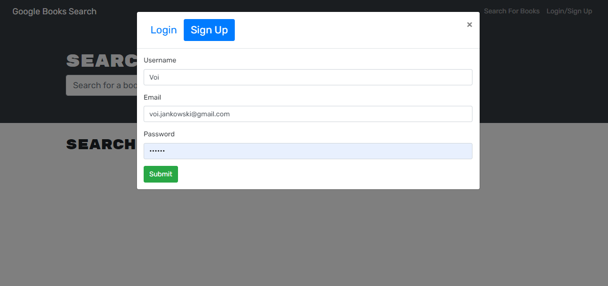
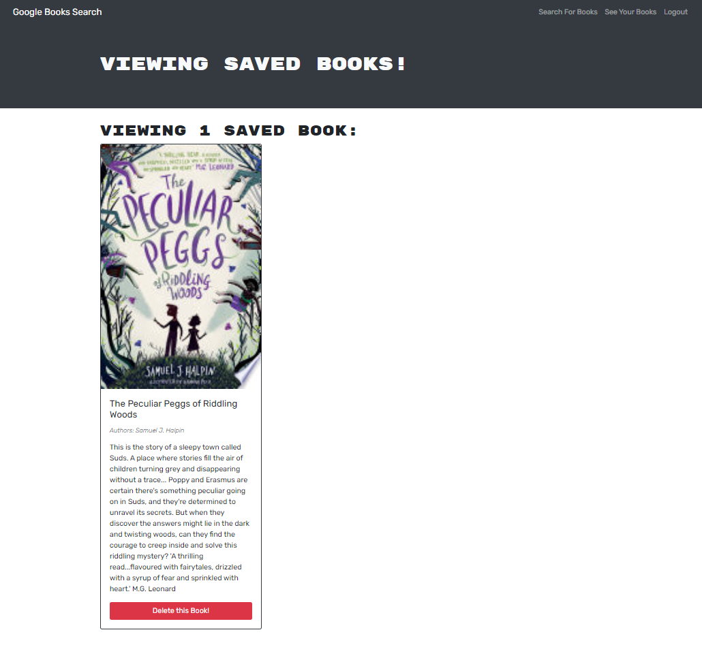

# Book Search Engine

## Description

The MERN Book Search Engine is a web application that allows avid readers to search for new books to read and keep a list of books to purchase. It provides a user-friendly interface powered by a GraphQL API built with Apollo Server. The application leverages the MERN stack, with a React front end, MongoDB database, and Node.js/Express.js server and API.

With the MERN Book Search Engine, users can perform book searches using keywords and view search results with details such as book titles, authors, descriptions, images, and links to the corresponding book on the Google Books site. Users can also create an account, log in, and save books to their personal account. The saved books are stored securely and can be accessed anytime. Additionally, users can view their saved books, remove books from their saved list, and log out when finished.

The MERN Book Search Engine combines the power of GraphQL, React, and MongoDB to deliver a seamless and personalized book searching and saving experience for users.

## Table of Contents

- [Usage](#usage)
- [License](#license)
- [Contributing](#contributing)
- [Questions](#questions)
- [Links](#links)

## Usage

1. On the home page, you will be presented with a menu featuring options such as Search for Books and Login/Signup. Additionally, you will find an input field to search for books and a submit button.

2. To search for books, click on the Search for Books menu option. Enter a search term in the input field and click the submit button.
3. If you are not logged in, you will be presented with several search results, each displaying a book's title, author, description, image, and a link to view the book on the Google Books site.

4. To create an account and access additional features, click on the Login/Signup menu option. A modal will appear with a toggle between Login and Signup.

5. To sign up for a new account, set the toggle to Signup and fill in the required information, including a username, email address, and password. Click the signup button to create your account.

6. If you already have an account, set the toggle to Login and enter your registered email address and password. Click the login button to access your account.

7. Once you are logged in, the menu options will change to Search for Books, Saved Books, and Logout.

8. Perform a book search by entering a search term in the input field and clicking the submit button. You will see search results similar to the previous step.

9. As a logged-in user, you can save a book to your account by clicking the Save This Book! button below each search result. The button will change to Book Already Saved after the book is saved.

10. To view your saved books, click on the Saved Books menu option. You will see a list of books you have saved, including their titles, authors, descriptions, images, and links to the Google Books site.

11. To remove a book from your saved books list, click the Remove button below the respective book.

12. If you wish to log out of your account, click on the Logout button.

(<a href="#readme-top">back to top</a>)

## License

This project is licensed under the MIT License. See the [LICENSE](./LICENSE) file for more information.

(<a href="#readme-top">back to top</a>)

## Contributing

If you have a suggestion that would make this better, please fork the repo and create a pull request. You can also simply open an issue with the tag "enhancement".
Don't forget to give the project a star!

1. Fork the Project
2. Create your Feature Branch (`git checkout -b feature/YourFeature`)
3. Commit your Changes (`git commit -m 'Add Your Feature'`)
4. Push to the Branch (`git push origin feature/YourFeature`)
5. Open a Pull Request

(<a href="#readme-top">back to top</a>)

## Questions

If you have any questions about the project please contact me through [my Github](https://github.com/voi-jankowski) or email me at [voi.jankowski@gmail.com](mailto:voi.jankowski@gmail.com).

(<a href="#readme-top">back to top</a>)

## Links

The location of the project [on GitHub](https://github.com/voi-jankowski/book-search-engine).

You can check out the live application [here](https://book-search-engine-12-07-2023-7771e309d21b.herokuapp.com/).

(<a href="#readme-top">back to top</a>)

